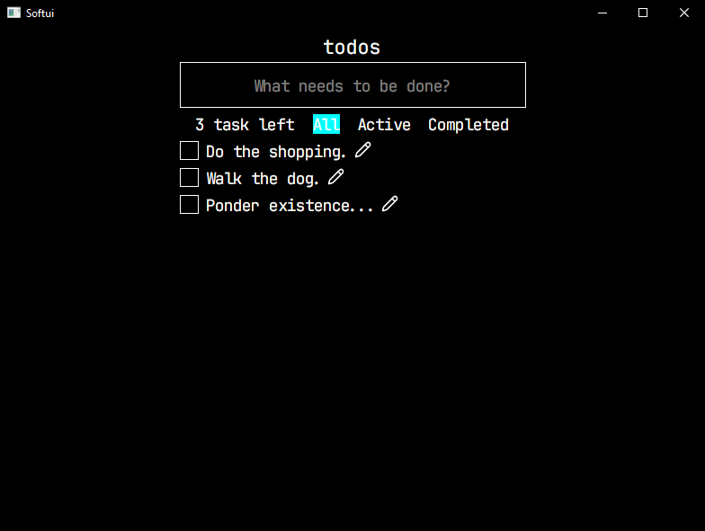

## Softui

> [!IMPORTANT]
> This library is currently under development and is not ready for use.
> It's designed to test Rust and its ability to express user-interface concepts; many of the systems rely on hacks and/or are duct-taped together.



This library provides tools for creating user-interfaces, it handles font-rendering, image/svg rendering, layout, input and window management.

Goals

- <50ms startup time
- Minimal dependencies (no waiting minutes for a single change)
- Extremely simple API (should require almost no effort to create complex interfaces)
- Clear font rendering with sub-pixel antialiasing
- Cross-platform (Windows, macOS)

Tradeoffs

- No GPU acceleration (simply initializing a GPU context would take ~300-1000ms depending on API)
- Immediate mode (fine for modern hardware, embedded systems may have problems)
- Insane use of unsafe code (this was mostly to save time and can be reduced over time)

```rust
use softui::*;

fn main() {
    let mut ctx = unsafe { create_ctx("Softui", 800, 600) };

    loop {
        if ctx.debug_should_quit() {
            break;
        }

        let root = h!(
            text("Example text"),
            rect().wh(100).bg(green()),
            rect().wh(100).bg(blue()),
            rect().wh(100).bg(cyan()),
            rect().wh(100).bg(magenta())
        )
        .gap(30)
        .bg(gray());

        ctx.draw_layout(root, true);
        ctx.draw_frame();
    }
}
```
